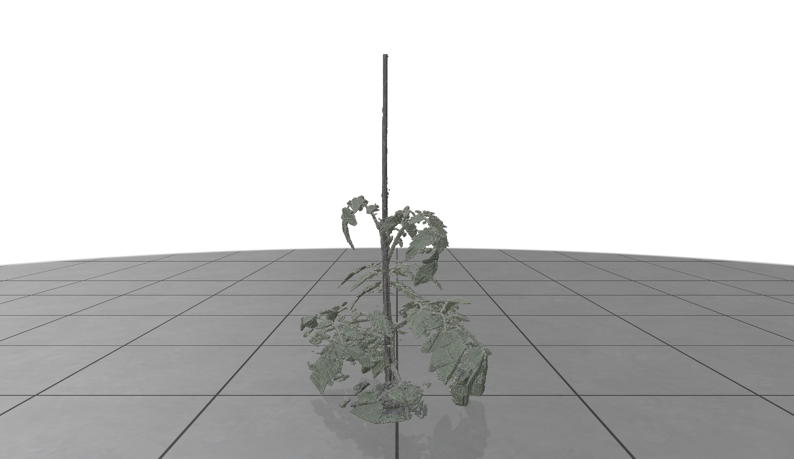
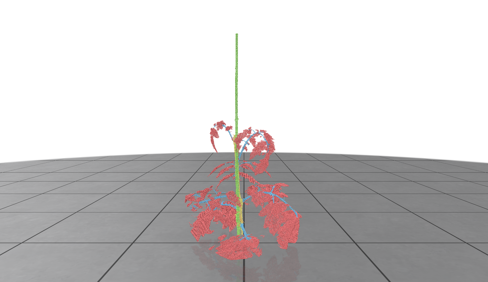
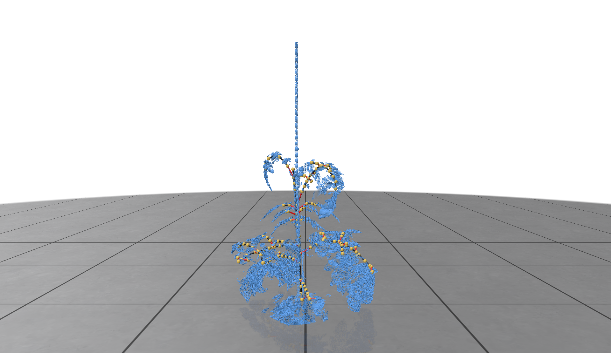

<!-- # Robot harvester: works perfect

> **Robot harvester: works perfect**\
> Me Myself, Some Supervisor, Some Other Person
> Paper: https://todo.nl -->

## About
Official implementation of data in brief: 

**An annotated dataset of tomato plants to quantitatively evaluate segmentation, skeletonisation, and plant trait extraction algorithms for 3D plant phenotyping**

Related to the dataset paper semantic segmentation:
3D plant segmentation: comparing a 2D-to-3D segmentation method with state-of-the-art 3D segmentation algorithms

## Installation
This software is tested on Python 3.11. To install the dependencies, run:
```
pip install -r requirements.txt
```

## Usage
Make sure to extract and download the dataset, this will be done automatically if path can not be found:
```
python3 wurTomato.py --visualise 0
```
For more examples have a look at the example_notebook.ipynb

Settings are described in config file

<center>
    <p align="center">
        
        
        
    </p>
</center>

## Citation
```

```

## Funding
This research is part of AgrifoodTEF
