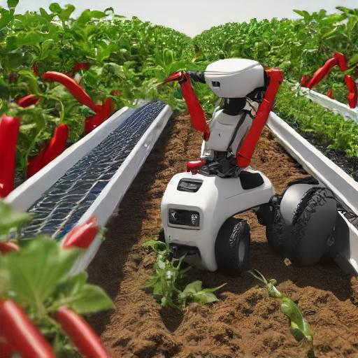
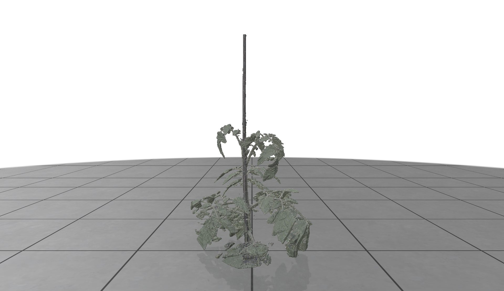
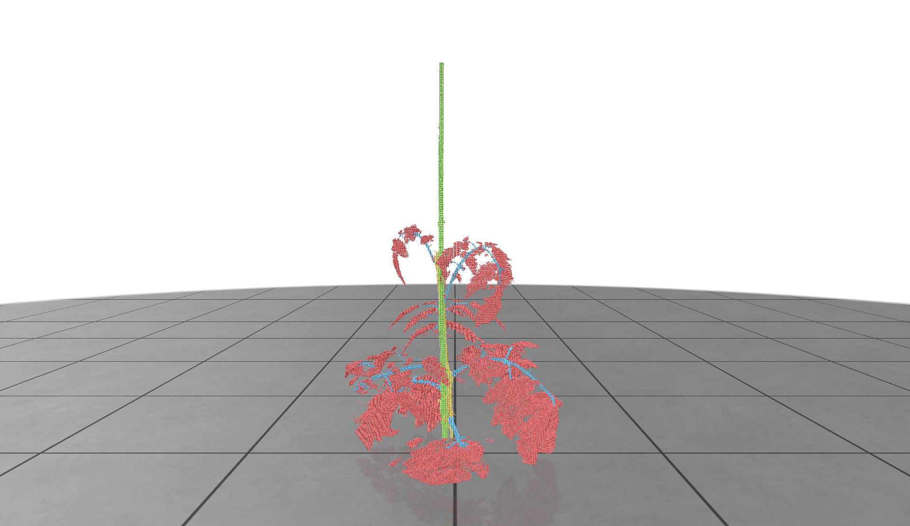
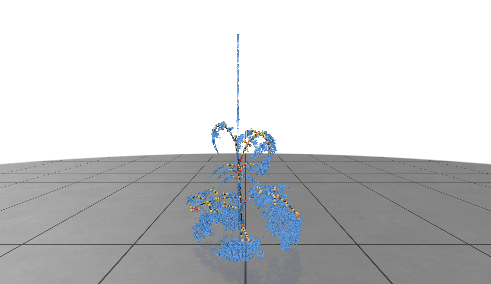

<!-- # Robot harvester: works perfect

> **Robot harvester: works perfect**\
> Me Myself, Some Supervisor, Some Other Person
> Paper: https://todo.nl -->

## About
Official implementation of [TomatoWUR](https://data.4tu.nl/datasets/e2c59841-4653-45de-a75e-4994b2766a2f/3)
 dataset: 

**An annotated dataset of tomato plants to quantitatively evaluate segmentation, skeletonisation, and plant trait extraction algorithms for 3D plant phenotyping**

The dataset is related to the paper:
- [3D plant segmentation: Comparing a 2D-to-3D segmentation method with state-of-the-art 3D segmentation algorithms](https://doi.org/10.1016/j.biosystemseng.2025.104147)
- [From point clouds to plant traits: investigation of a pipeline for phenotyping of tomato plants using skeletonisation](https://doi.org/10.1016/j.biosystemseng.2026.104554)

## Changes:
- 2025-11-14 published original TomatoWUR repo --> release tag: original_tomatowur_paper
- 2026-05-27 In point cloud to plant traits paper 4 annotations errors were found. These annotations are added to the 4TU dataset version 3.
- 2026-07-31 Added updates of point cloud to plant traits paper in this REPO. This includes.
    - Improved skeleton evaluation method
    - Additional skeletonisation methods.
    - deprecated CLI interface -> only config files instead. 
    ```python3 wurTomato.py --config config.yaml```
    For reproduceability of Point clouds to plait traits paper we recommend [git](https://github.com/WUR-ABE/point_cloud_to_plant_traits) related to that publication. 
- 2026-07-31: created pyproject. TODO check pc_skeletor dependency

## Installation
This software is tested on Python 3.11. To install the dependencies, run:
```bash
pip install tomatowur
```
OR to work locally and use pc_skeletor as well:
```bash
git clone https://github.com/WUR-ABE/TomatoWUR.git
cd tomatowur
conda create --name tomatowur python=3.11
conda activate tomatowur
pip install -e .
## for laplacian skeletonisation also install pc_skeletor
# pip install -e src/tomatowur/skeletonisation_methods/pc_skeletor/.
## verify installation with
python3 -c "import tomatowur"
```


## Usage
Make sure to extract and download the dataset, this will be done automatically if path can not be found:
```
wurtomato --config config.yaml run_mode=["visualise"]
```
For more examples have a look at the example_notebook.ipynb

Settings are described in config file

<center>
    <p align="center">
        
        
        
    </p>
</center>

<center>
    <p align="center">
        
    </p>
</center>

## Citation
If you only use the TomatoWUR dataset, please use the citation below.
If your work also uses components from the [2D-to-3D segmentation](https://doi.org/10.1016/j.biosystemseng.2025.104147) or the [point cloud to plant traits]() papers, please cite those as well.
```
@article{VANMARREWIJK2025111852,
title = {TomatoWUR: An annotated dataset of tomato plants to quantitatively evaluate segmentation, skeletonisation, and plant-trait extraction algorithms for 3D plant phenotyping},
journal = {Data in Brief},
volume = {61},
pages = {111852},
year = {2025},
issn = {2352-3409},
doi = {https://doi.org/10.1016/j.dib.2025.111852},
url = {https://www.sciencedirect.com/science/article/pii/S2352340925005773},
author = {Bart M. {van Marrewijk} and Tim {van Daalen} and Katarína Smoleňová and Bolai Xin and Gerrit Polder and Gert Kootstra},
}
```

## Related research
- [2Dto3D segmentation](https://doi.org/10.1016/j.biosystemseng.2025.104147)
- [Point cloud to plant traits](https://doi.org/10.1016/j.biosystemseng.2026.104554)

## Funding
This research is part of AgrifoodTEF: Test and Experiment Facilities for the Agri-Food Domain (101100622)
